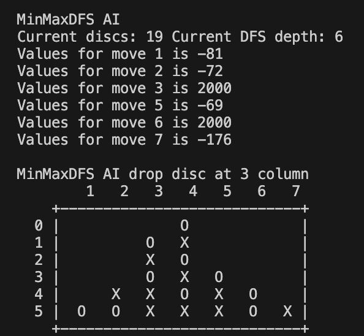

# Connect Four AI

This Connect Four AI was developed as the final coursework for the **Introduction to Computer Science** course in the **Department of Electrical Engineering at NCKU** in 2019. 

## 🏆 Achievement

This AI earned **1st place out of nearly 300 students** in the course-wide AI tournament, with an impressive record of **1 loss and 1 draw**. To this day, I still cannot defeat this AI myself.

## 💡 Strategy

The core of the AI is built using:

- **Minimax Strategy** for decision making  
- **Depth-First Search (DFS)** for exploring move possibilities

To better handle the tournament’s time constraints, I designed improved search strategies for both **opening** and **endgame** situations.

## 📚 Significance

This was my **first project involving data structures and algorithms**, and it marked a major milestone. Its success gave me the confidence and motivation to pursue a **Computer Science** career.

## 🖼️ Demo

Here’s a snapshot of the game interface:



## ⚙️ How to Run (on macOS)

To compile and run the project:

```bash
clang++ -std=c++17 -o connect4 source.cpp
./connect4
